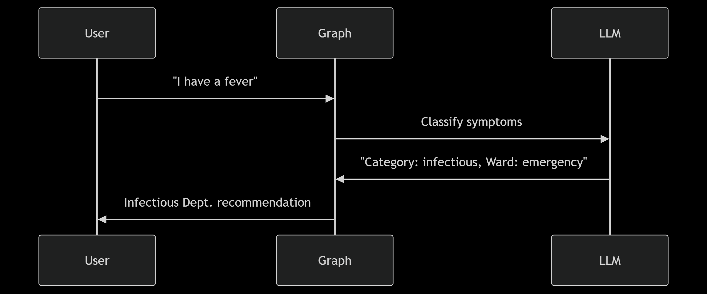
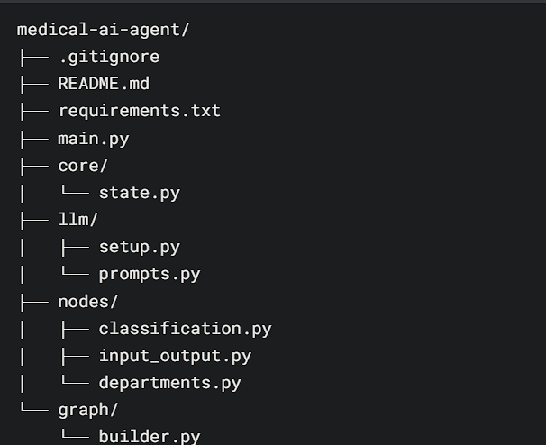
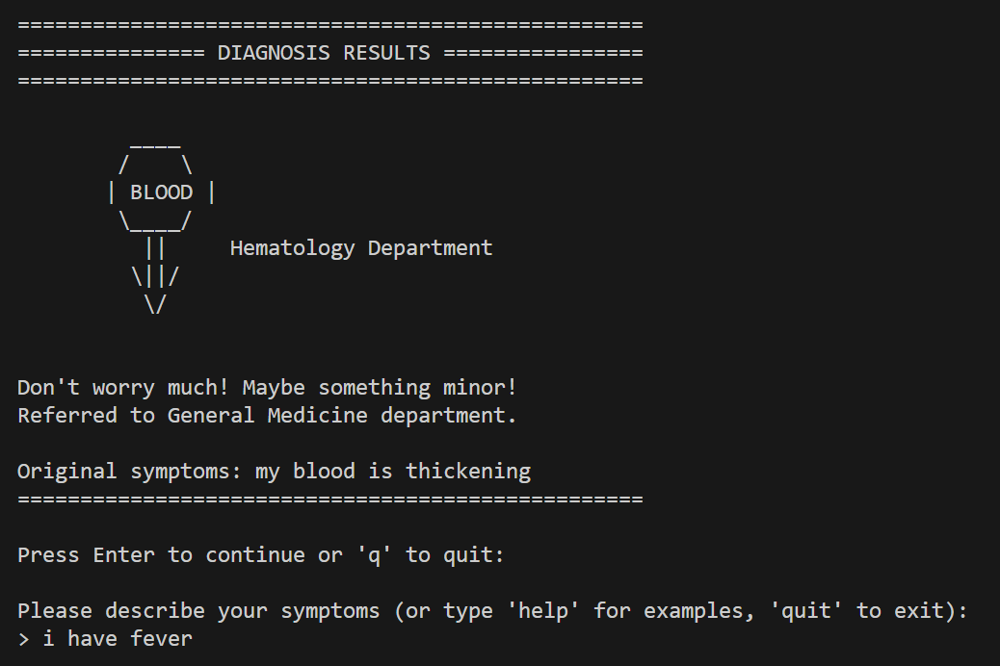
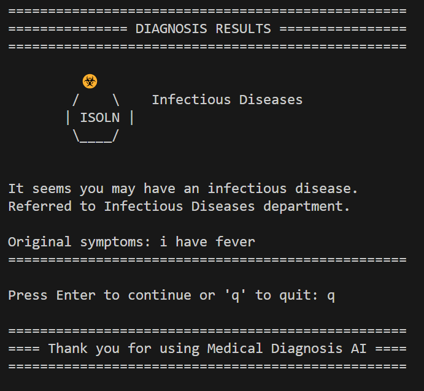

# MediDoc AI Agent 🏥

- A smart symptom classifier that routes patients to hospital departments using Google Gemini. 
- Built with LangGraph for robust workflow orchestration, this AI agent delivers instant triage recommendations with clear explanations. 
- Perfect for healthcare prototypes, medical education, or AI experimentation.

 ## Features
- Symptom analysis via Google Gemini
- Department-specific recommendations
- ASCII art visualization
- Error-resilient workflow

 

## Multi-Node Processing (Modular Pipeline Architecture)
 <p >
  
</p>

## Technology Stack

| Component       | Purpose                                 | Version    | Documentation |
|----------------|------------------------------------------|------------|----------------|
| **LangGraph**   | Workflow orchestration & state management | 0.0.9      | [Docs](https://langchain-ai.github.io/langgraph/)      |
| **Google Gemini** | Medical symptom classification            | 1.5-flash  | [API Docs](https://ai.google.dev/gemini-api/docs)  |
| **LangChain**   | LLM integration & prompt templating       | 0.1.11     | [Guide](https://python.langchain.com/docs/introduction/)     |


## Setup Guide (In case you really want to explore)

1. **Clone the repository**
   ```bash
   git clone https://github.com/astroxphiliauxx/MediDoc-AI-Agent.git
   cd MediDoc-AI-Agent
   ```

2. **Set up environment**
   ```bash
   python -m venv venv
   source venv/bin/activate  # Linux/Mac
   venv\Scripts\activate     # Windows
   ```

3. **Install dependencies**
   ```bash
   pip install -r requirements.txt
   ```

4. **Add your API key**
   - Create `.env` file:
     ```bash
     echo "GOOGLE_API_KEY=your_api_key_here" > .env
     ```
   - Get a key from [Google AI Studio](https://aistudio.google.com/)

5. **Run the system**
   ```bash
   python main.py
   ```


## File structure: 

 <p >
  
</p>

## Usage Example
<p align="center">
  
  
</p>


## Contribution
Feel free to fork and submit PRs for:
- New department responses
- Better error handling
- Additional symptom patterns

## License
This project is licensed under [MIT](LICENSE). (COPY CATS stay away !!!)
